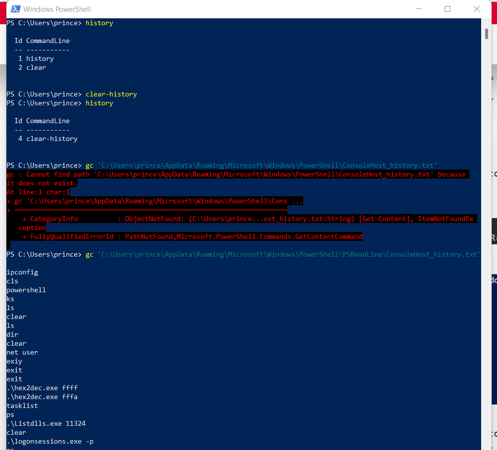
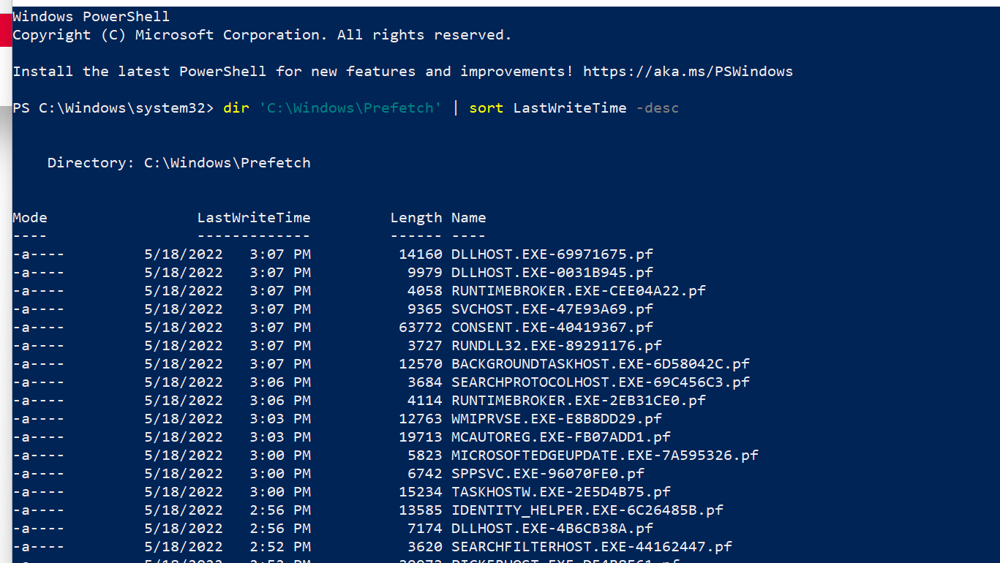
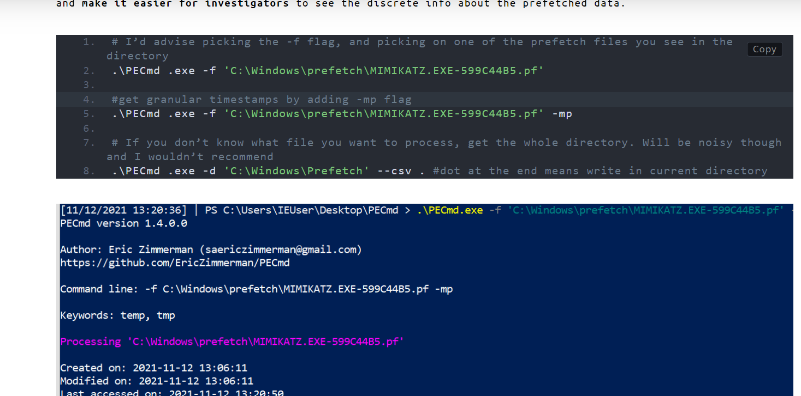
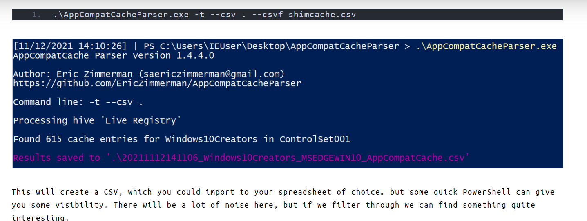

# <b> Log Less Investigation </b>


## If LOG are not managed or Erased by the Attacker.


## There are many ways, Some are:

# <b> PS history checking: </b>

Some cmds are:

```powershell
history
clear-history
```

- Checking the HISTORY directory:
    
    ```powershell
    gc 'C:\Users\<user>\AppData\Roaming\Microsoft\Windows\PowerShell\PSReadLine\ConsoleHost_history.txt'
    ```
    
    
    

## <b> Prefetch: </b>

- prefetch is cache type of thing used to monitor the application for first few seconds to make relaunching effectively.
- It can be used to check the Application that where launched.

```powershell
dir 'C:\Windows\Prefetch' | sort LastWriteTime -desc
```



- We get many .pf (Windows Prefetch files) to read them.
    - we need: https://github.com/EricZimmerman/PECmd
    - EXE: [Eric Zimmerman's tools](https://ericzimmerman.github.io/#!index.md)



### Drawback:

- Prefetch is off In server by default

## <b> Shimcache: </b>

The TOOL: [Eric Zimmerman's tools](https://ericzimmerman.github.io/#!index.md)

[https://f001.backblazeb2.com/file/EricZimmermanTools/AmcacheParser.zip](https://f001.backblazeb2.com/file/EricZimmermanTools/AmcacheParser.zip)



## <b> References: </b>

- [No Logs? No Problem! Incident Response without Windows Event Logs | JUMPSEC LABS](https://labs.jumpsec.com/no-logs-no-problem-incident-response-without-windows-event-logs/)

<br><br>

# <b> 📞Contact: </b>
- [Prince Prafull](https://www.linkedin.com/in/prince-prafull-19a477194/)
